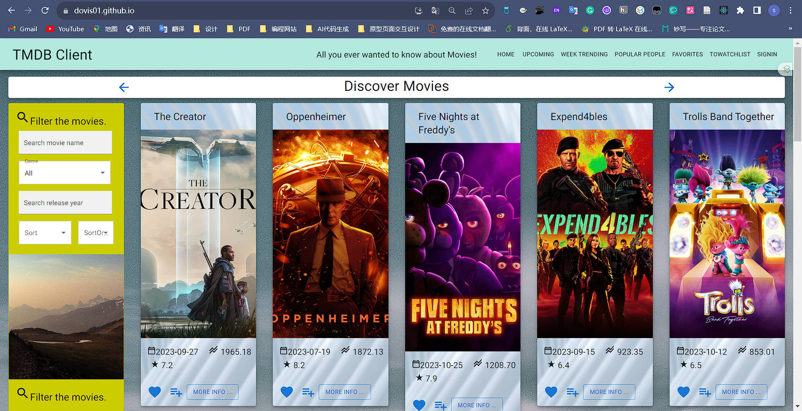

# Assignment 1 - ReactJS app.

Name: Shijin Zhang

`Website for early version deploym`: [https://dovis01.github.io](https://dovis01.github.io)

`YouTube`:  [https://www.youtube.com/watch?v=1wJ7hZjHOYI](https://www.youtube.com/watch?v=1wJ7hZjHOYI)

## Overview.

The purpose of this warehouse is to extend the React Movie App created in the lab. It has been extended in many ways, and it fully meets the requirements of CA Assignment. It fully applies the React knowledge learned before to it, constantly exercises my programming ability and gains a lot from it.

## Features.
+ **New Material UI Components**
  + `ThemeProvider`: Implemented with createTheme and palette to customize colors, altering the themes of `SiteHeader`, `FilerCard`, and `HeaderMovieList` component.
  + `Pagination`: A customized paginator to display movie list pagination, showing all movies available from the API.
  + `Stack`: Used to wrap the `Pagination` component.
  + `LinearProgress`: Replaces the `Circle` component to dynamically display page loading, altering the Spinner's appearance.
  + `Dialog`: Wraps videos for on-page playback.

+ **Background Image**
  + Enhanced web page background and MovieCard backgrounds with custom images. For other display pages, only the background colors were changed, moving away from a plain white background.

+ **SiteHeader**
  + Added multiple buttons for webpage navigation, categorized into sub-menus (triggered by mouse hover). Includes Movie, People, Personal categories, plus Home and SignIn buttons.
  + The signIn button varies based on user login status: shows the user's profile icon (based on the first letter or number of their email or username) when logged in; otherwise, displays the signIn button.
  + Adapted for different window sizes, suitable for mobile devices, with sub-menu options for smaller screens. Sub-menus are activated by mouse hover. Spacing between main menu buttons was also increased for aesthetic improvement.

+ **Filer Card**
  + Added new filtering options for sorting movies by year.
  + Introduced sorting functionality, allowing ascending or descending order based on each MovieCard's popularity and rating votes. Users can also select "none" for no sorting.

+ **Refactor Template File**
  + Modified the existing movie layout template file, making the addition of avatars more flexible. Avatars are now an injectable property into the template file, allowing for variation based on different page requirements. Added new buttons and success indicators for adding movies to the toWatchList, with options for marking movies as liked and to-watch.

+ **API Request**
  + Changed the number of movies requested per page from the API, enhancing its functionality. Increased from showing 20 movies per page to 40, achieved by making two parallel requests. This change applies to all list requests, including those for popular actors and personalities.

+ **New Static Endpoints Page**
  + For the Movie category, added "Now Playing" and "Week Trending" movie list pages.
  + For the People category, added "Popular People" and "Week Trending" people list pages.
  + Added a “toWatchList” page, displaying all selected movies to watch.

+ **Firebase Third Party Authentication**
  + Integrated Firebase for Google and GitHub logins, as well as native email registration and login.
  + Provided rich error messaging for various scenarios, enabling users to understand their errors more intuitively.

+ **Movie Card / Movie Detail**
  + Added new buttons to add movies to favorite and to-watch lists, and included attributes for filtering in each card. Movie titles exceeding a certain length are truncated with ellipses.
  + The movie detail page now includes information about the production companies, and new buttons for accessing a full list of related actors and recommended similar movies. Briefly displays related actors using a scrollbar, with clickable cards leading to detailed actor information pages (URLs are multi-parameter designed). The page also features two trailers for each movie.

+ **People Card / People Detail**
  + Created new template files for displaying actor details, list templates, detail display templates, and actor card files.
  + Actor cards display three attributes: popularity, gender, and department.
  + Actor names are truncated with ellipses when they exceed a certain length.
  + The actor detail page shows a new button to access all movies the actor has participated in, and uses a scrollbar to display all their movie and TV works. Clickable cards lead to detailed movie pages (URLs are multi-parameter designed). This section also displays the actor's personal details like birthdate, birthplace, popularity, and gender.


## Setup requirements.

I used `npm` to manage packages in this project, and uploaded the `package.json` file. Enter `npm install` to install all the dependencies demanded.

After installing all packages, use `npm start` to run this project. Open [http://localhost:3000](http://localhost:3000/) to view it in your browser.

Scripts listed here:

- `npm install` - install npm dependencies
- `npm start` - start the react project
- `npm run build` - bundle up this application
- `npm run deploy` - deployment command

Notice: API Key is necessary to run successfully. Files `.env` and `cypress.env.json` should be created in root folder. The content in the file is like:

```javascript
// .env
REACT_APP_TMDB_KEY = <<Your_TMDB_API>>
FAST_REFRESH = false

// .cypress.env.json
{
  "TMDB_KEY": <<Your_TMDB_API>>
}
```

## API endpoints.

- **Discover Movies**: Fetches a paginated list of movies based on various criteria for discovery.
  - `/discover/movie`
- **Movie Details**: Retrieves detailed information about a specific movie by ID.
  - `/movie/{movie_id}`
- **Movie Genres**: Gets a list of movie genres.
  - `/genre/movie/list`
- **Movie Images**: Obtains a collection of images related to a specific movie.
  - `/movie/{movie_id}/images`
- **Movie Videos**: Provides video clips including trailers related to a specific movie.
  - `/movie/{movie_id}/videos`
- **Movie Credits**: Fetches the cast and crew for a specific movie.
  - `/movie/{movie_id}/credits`
- **Movie Reviews**: Retrieves user-submitted reviews for a specific movie.
  - `/movie/{movie_id}/reviews`
- **Upcoming Movies**: Lists movies that are scheduled to be released in the near future.
  - `/movie/upcoming`
- **Now Playing Movies**: Shows movies that are currently playing in theaters.
  - `/movie/now_playing`
- **Trending Movies of the Week**: Displays a list of movies trending over the week.
  - `/trending/movie/week`
- **Movie Recommendations**: Suggests movies similar to a specific movie.
  - `/movie/{movie_id}/recommendations`
- **Popular People**: Lists popular actors and filmmakers.
  - `/person/popular`
- **Trending People of the Week**: Shows which actors and filmmakers are trending weekly.
  - `/trending/person/week`
- **Person Details**: Provides detailed information about a specific person in the industry.
  - `/person/{person_id}`
- **Person Images**: Obtains a collection of images related to a specific person.
  - `/person/{person_id}/images`
- **Person Movie Credits**: Fetches the movie credits of a particular person.
  - `/person/{person_id}/movie_credits`
- **Person TV Credits**: Retrieves the television credits of a specific person.
  - `/person/{person_id}/tv_credits`

## Routing.

+ `/people/popular` - Displays a list of popular actors and filmmakers.
+ `/people/weektrending` - Shows trending people on a weekly basis.
+ `/people/popular/:actorId` - Displays detailed information about a particular actor or filmmaker.
+ `/movie/:movieId/people/popular/:actorId` - Displays detailed information for an actor within the context of a specific movie.
+ `/people/popular/:id/related_movies` - Shows movies related to a particular actor or filmmaker.
+ `/reviews/form` - The page where users can add movie reviews.
+ `/movies/upcoming` - Lists all upcoming movies.
+ `/movies/nowplaying` - Lists movies that are currently playing in theaters.
+ `/movies/weektrending` - Displays trending movies for the week.
+ `/movies/favorites` - Shows a user's favorite movies.
+ `/movies/watchlist` - Displays a user's personal watchlist.
+ `/reviews/:id` - Provides a detailed view of a particular movie's reviews and comments.
+ `/movies/:movieId` - Shows detailed information about a specific movie.
+ `/people/popular/:actorId/movies/:movieId` - Redirects to the movie details page from the actor's profile.
+ `/movies/:id/recommendations` - Displays recommended movies related to a specific movie.
+ `/movies/:id/related_actors` - Shows actors related to a particular movie.
+ `/` - The home page of the application.
+ `/signin` - The sign-in page for user authentication.
+ `/signup` - The sign-up page for new users.
+ `*` - A wildcard route that redirects to the home page if the user visits a non-existent route.

All of these are public.

## Independent learning.

#### Firebase Authentication Integration

During the development of this React application, I independently researched and integrated Firebase Authentication to provide a secure and versatile user authentication system. 

This is the firebase configuration file : [`firebase.js`](https://github.com/Dovis01/react-movie-CA1/blob/main/movies/src/firebase.js)

- **Google Sign-In**: Implemented OAuth login with Google using Firebase, allowing users to authenticate with their Google accounts. The integration was performed by utilizing the Firebase Auth library and configuring the OAuth consent screen in the Google Cloud Console.
  - _Source Files_:  [`thirdPartyAuthSignIn/index.js`](https://github.com/Dovis01/react-movie-CA1/blob/main/movies/src/components/thirdPartyAuthSignIn/index.js)
  - _Resources_:  [Firebase Google Authentication Documentation](https://firebase.google.com/docs/auth/web/google-signin)

- **GitHub Sign-In**: Added GitHub authentication by registering the application on GitHub, obtaining OAuth credentials, and configuring them within Firebase. This provides an alternative method for developers and tech-savvy users to log in using their GitHub accounts.
  - _Source Files_:  [`thirdPartyAuthSignIn/index.js`](https://github.com/Dovis01/react-movie-CA1/blob/main/movies/src/components/thirdPartyAuthSignIn/index.js)
  - _Resources_:  [Firebase GitHub Authentication Guide](https://firebase.google.com/docs/auth/web/github-auth)

- **Email/Password Authentication**: Developed a traditional sign-in system that uses email and password. This method includes user registration, login, and password reset features by leveraging Firebase's email/password authentication capabilities.
  - _Source Files_:  [`thirdPartyAuthSignUp/index.js`](https://github.com/Dovis01/react-movie-CA1/blob/main/movies/src/components/thirdPartyAuthSignUp/index.js), [`signInPage.js`](https://github.com/Dovis01/react-movie-CA1/blob/main/movies/src/pages/signInPage.js)
  - _Resources_:  [Firebase Email Authentication Documentation](https://firebase.google.com/docs/auth/web/password-auth)

Each authentication method was thoroughly tested to ensure security and a smooth user experience. The Firebase console was used to monitor and manage user sessions and activity.

#### New Material UI Component

+ `ThemeProvider`: Implemented with createTheme and palette to customize colors, altering the themes of `SiteHeader`, `FilerCard`, and `HeaderMovieList` component.
+ `Pagination`: A customized paginator to display movie list pagination, showing all movies available from the API.
+ `Stack`: Used to wrap the `Pagination` component.
+ `LinearProgress`: Replaces the `Circle` component to dynamically display page loading, altering the Spinner's appearance.
+ `Dialog`: Wraps videos for on-page playback.

The resource document reference is  [https://mui.com/material-ui/getting-started](https://mui.com/material-ui/getting-started/) 

#### System Deployment 

Use `GitHub Pages` to implement the simple deployment for the early version of system.

- Add configuration of auto deployment in [`package.json`](https://github.com/Dovis01/react-movie-CA1/blob/main/movies/package.json)

Use cypress test framework to do some basic E2E auto test.

- Test files are in  [`cypress/e2e/*`](https://github.com/Dovis01/react-movie-CA1/tree/main/movies/cypress/e2e)

This is the online resources that helped me to realize a simple deployment using the early version of Movie App.

The reference resource is  [https://create-react-app.dev/docs/deployment](https://create-react-app.dev/docs/deployment)

Visit the early version project:  [https://dovis01.github.io](https://dovis01.github.io)




